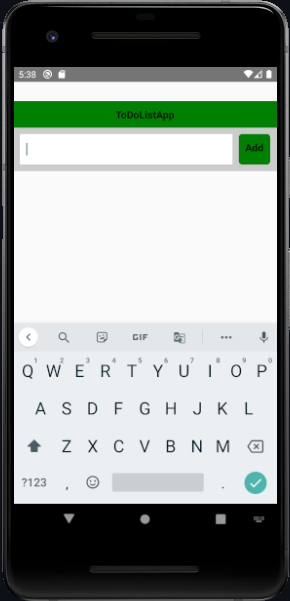
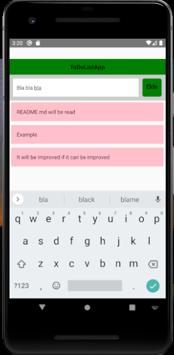
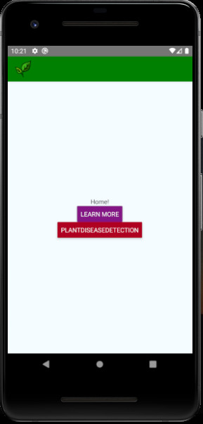
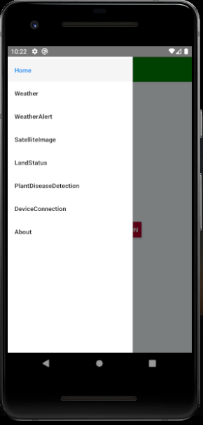

# react-native-SimpleExamples

You can find simple tutorial examples I made while learning mobile applications in React native in this repository.

# [Simple TO-Do-List Aplication](https://github.com/Meleknaz/react-native-SimpleExamples/tree/main/ToDoListApp)

✨ ToDoList application that I developed to learn basic react native usage.

 

```JavaScript
```

# [usingNavigation](https://github.com/Meleknaz/react-native-SimpleExamples/tree/main/UsingNavigation)

✨ Simple application I made about using navigator with React native, switching between pages, adding page title, adding icon.

 
