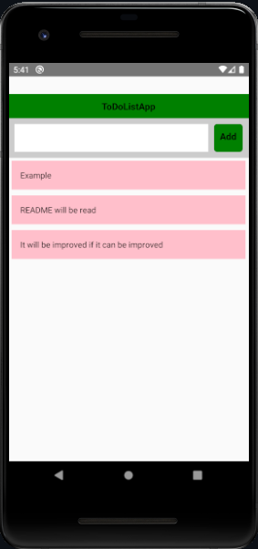

# react-native-SimpleExamples

You can find simple tutorial examples I made while learning mobile applications in React native in this repository.

# [Simple TO-Do-List Aplication](https://github.com/Meleknaz/react-native-SimpleExamples/tree/main/ToDoListApp)


```JavaScript
```



